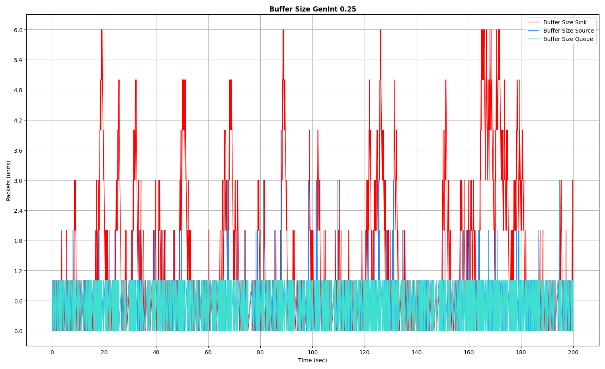
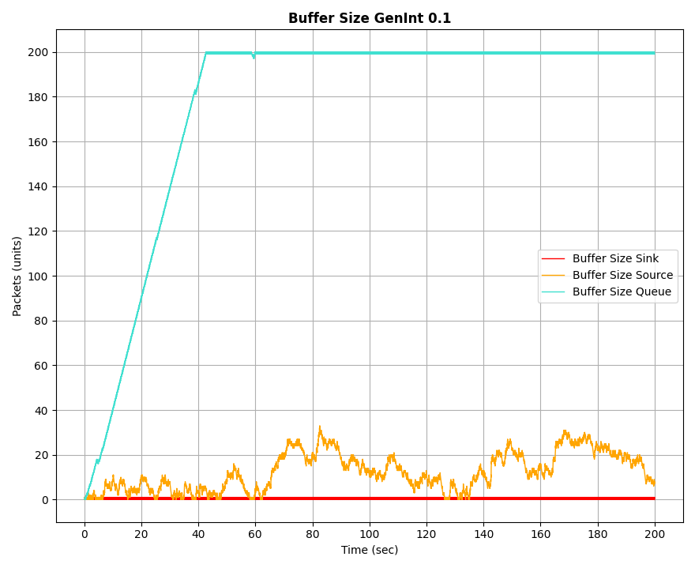
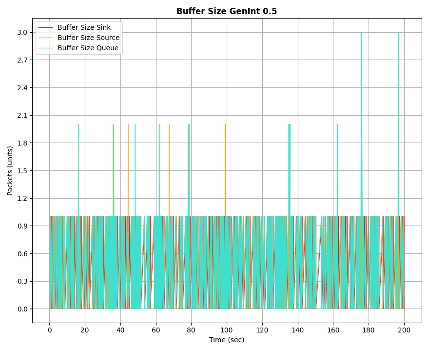

# Analisis de simulaciones discretas sobre una red simple de productor consumidor en Omnet++ 

## Resumen:
Bajo el entorno de simulaciones de redes que provee Omnet++ desarrollamos dos instancias de experimentacion para el analisis de las utilidades de los protocolos de control de flujo y congestion.

En primer lugar se observo el comportamiento de una red simple sin la implementacion de dichos protocolos, mientras que en la segunda se diseño {nombre del protocolo}. Observamos los siguientes resultados: optimizacion etc etc. 

## Índice

1. [Introducción](#introducción)

    1.1. [Metodolodia de trabajo](#metodologia-de-trabajo)

2. [Parte 1](#parte-1)

    2.1 [Casos de analisis](#casos-de-analisis)

    2.2 [Observaciones](#observaciones)
    
3. [Parte 2: Metodos](#parte-2:-Metodo)
4. [Resultados](#resultados)
5. [Discusión](#discusión)
6. [Referencias](#referencias)

## Introducción:
El objetivo del analisis de casos es comprender las dificultades que atraviesa la capa de transporte (modelo OSI) en diferentes escenarios para proporcionar un protocolo de control. Particularmente nos enfocamos en los problemas de flujo y congestion en una red TCP/IP simulada. 

El problema de control de flujo refiere a la ausencia de un mecanismo en TCP para controlar que el bufer del consumidor no se sobrecargue, provocando la perdida de paquetes entre otros efectos indeseados. 

El problema de control de congestion consiste mas bien a la red (o subred) que esta entre ambos nodos, donde esta no soporta la cantidad de datos del emisor, provocando errores similares que en el caso anterior, pero en campos intermedios. 

### Metodologia de trabajo: 
Para desarrollar las tareas necesitariamos la implementacion de una red, sin embargo esto requiere cantidades de elementos y sistemas que no disponemos, alternativamente, trabajaremos con una tecnica de modelizacion y analisis de sistemas dinamicos llamada simulacion discreta con la tecnologia Omnet++. 
La simulacion discreta divide las varibales en pasos discretos y calcula el estado del sistema en funcion de estos pasos y bajo las reglas del modelo implementado. 
Es gracias a Omnet++ que logramos una red simple y podemos ejecutarla en un entorno medido y seguro de simulacion, rescatando los objetos de analisis y eliminando inconvenientes propios de una red real. 

El modelado de red cuenta con tres partes `NodeTx` compuesto a su vez por una clase Generator y una `Queue`, este nodo referencia a un emisor con su bufer. Luego Queue a modo representativo de la demora en la subred y finalemente `NodeRx` con una estructura similar a su remitente, compuesto por un Sink y Queue representando al receptor con su respectivo bufer. 

 

Se instanciaran variables que nos ayudaran a medir el comportamiento del flujo a lo largo de un ajecucion de 200 segundos y ayudaran a terminar el modelado de la red. 

Mediante una generacion aleatoria de valores por medio de la funcion exponencial(0.1) se establecen intervalos de tiempo con una media de 100ms para crear paquetes de 12500 bytes en NodeTx. El bufer de este nodo tendra una capacidad deliberadamente alta, ya que no afecta a los objetivos de este proyecto, por este mismo motivo el tamaño de los bufers de los nodos restantes sera de 200 paquetes. 
La capacidad de tranmision entre nodos sera tipicamente de 10 paquetes por segundo, salvo en los casos de analisis. 

El funcionamiento de la red sigue el orden y lineamientos de una tipica conexion emisor-receptor. En primera instancia, veremos como afectan ciertas modificaciones a las variables.

## Parte 1 
En ambos casos se necesitaron nuevas metricas para medir el desempeño de Queue.
*bufferSizeVector*, la cual mide la cantidad de paquetes en el bufer y *packetDropVector*, que mide la cantidad de paquetes descartados por el bufer saturado 

### Casos de analisis

    Caso 1 - Problema de control de flujo

Para este caso se establecieron las siguientes tasas de transferencia:

- Entre la cola Rx y sink: 0.5Mbps
- Entre la cola Tx y Queue: 1Mbps
- Entre Queue y la cola Rx: 1Mbps
----
Observaciones:
Se realizaron pruebas variando entre los siguientes intervalos de generación de paquetes: 0.1, 0.25 y 0.5.

Se obtuvieron los siguientes resultados:

| 0.1 | 0.25 | 0.5 |
|-----|-----|-----|
|    |    |    |

Como se observa, mientras mayor es el intervalo de generacion de paquetes, menor sera la cantidad de los mismos y por tanto, menor es la pedida de paquetes en el bufer del consumidor, ya que tiene mas tiempo para procesarlos. 

El caso problematico es mas visible con el valor 0.1

| 0.1 |
|-----|
| |
|              |

El problema ocurre con el intervalo establecido en 0.1, ya que como podemos suponer al ver las graficas, saturó al bufer y por tanto, los paquetes tardaron mas en llegar, corriendo el riesgo de ser descartados.
Gracias a los graficos obtenidos se puede ver una clara relacion entre la saturacion del bufer con el incremento de la tasa de delay. El comunmente llamado cuello de botella.
Como las metricas de los otros nodos no sufrieron modificaciones, vemos que fluctuan en valores mucho menores al limite de sus capacidades. 
Ademas, aunque parezca redundante, la situacion se mantiene igual hasta el final de la simulacion, es decir, no logra compensarse ni recomponerse. 

    Caso 2 - Problema de control de congestión

Para este caso se establecieron las siguientes tasas de transferencia:

- Entre la cola intermedia y la cola Rx: 0.5Mbps
- Entre la cola Tx y la cola intermedia: 1Mbps
- Entre la cola Rx y el recolector: 1Mbps
---
Observaciones:
Se realizaron pruebas variando entre los siguientes intervalos de generación de paquetes: 0.1, 0.25 y 0.5.

Se obtuvieron los siguientes resultados:

| 0.1 | 0.25 | 0.5 |
|-----|-----|-----|
|    |    |    |

Nuevamente el problema es mas visible en intervalos menores, por lo anterior mencionado.

El caso problematico es mas visible con el valor 0.1

| 0.1 |
|-----|
| |
|          |

Como puede verse, los casos son analogos. La unica diferencia esta en el lugar donde se produzca la saturacion del bufer. 

# Parte 2 Metodo
Propuesta de solucion: parte dos 
//hipotesis de porque va a funcionar 

# Resultados:
Graficos de los resultados y analisis de ellos

# Discusiones: 
autocritica 
ideas a trabajo futuro 

# Referencias: 
Bibliografia (si hay tiempo codigo APA)