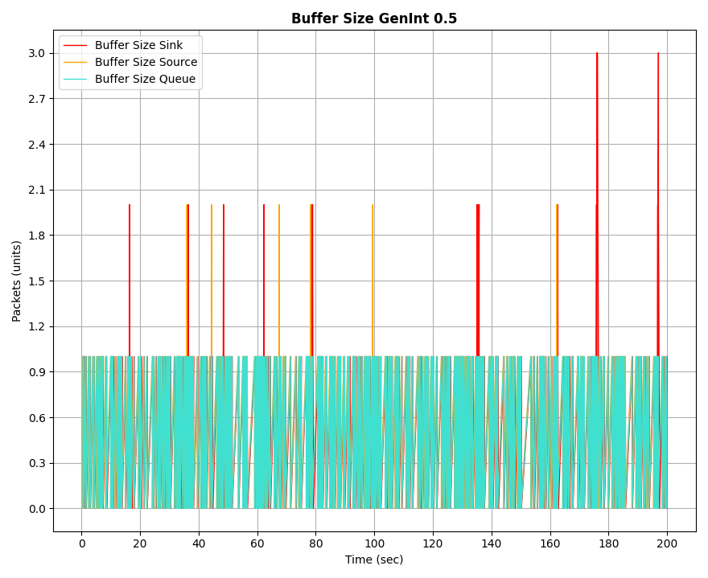
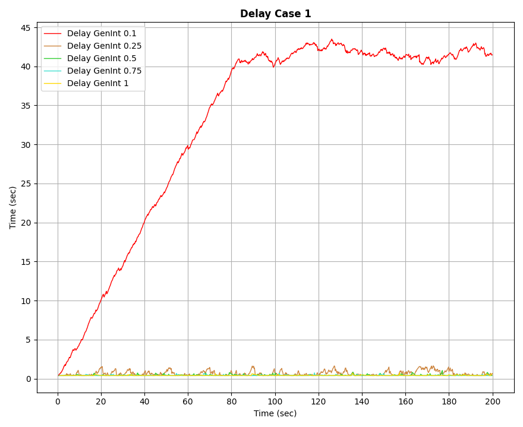
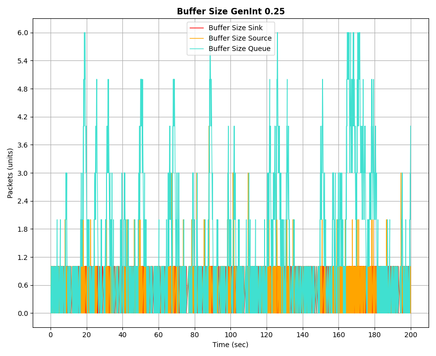

# Análisis de simulaciones discretas sobre una red simple de productor-consumidor en Omnet++ 

## Tabla de Contenidos
1. [Resumen](#resumen)
2. [Introducción](#introducción)
    - [Metodología de Trabajo](#metodología-de-trabajo)
3. [Parte 1](#parte-1)
    - [Casos de Análisis](#casos-de-análisis)
4. [Parte 2: Métodos](#parte-2-métodos)
5. [Resultados](#resultados)
6. [Discusiones](#discusiones)
7. [Referencias](#referencias)

## Resumen
Bajo el entorno de simulaciones de redes que provee Omnet++, desarrollamos dos instancias de experimentación para el análisis de las utilidades de los protocolos de control de flujo y congestión. En primer lugar, se observó el comportamiento de una red simple sin la implementación de dichos protocolos, mientras que en la segunda se diseñó `{nombre del protocolo}`. Observamos los siguientes resultados: optimización etc etc.

## Introducción:
El objetivo del análisis de casos es comprender las dificultades que atraviesa la capa de transporte (modelo OSI) en diferentes escenarios para proporcionar un protocolo de control. Particularmente nos enfocamos en los problemas de flujo y congestión en una red TCP/IP simulada. 

El problema de control de flujo refiere a la ausencia de un mecanismo en TCP para controlar que el búfer del consumidor no se sobrecargue, provocando la pérdida de paquetes entre otros efectos indeseados. 

El problema de control de congestión consiste más bien en la red (o subred) que está entre ambos nodos, donde esta no soporta la cantidad de datos del emisor, provocando errores similares que en el caso anterior, pero en campos intermedios. 

### Metodología de trabajo: 
Para desarrollar las tareas necesitaríamos la implementación de una red, sin embargo, esto requiere cantidades de elementos y sistemas que no disponemos. Alternativamente, trabajaremos con una técnica de modelización y análisis de sistemas dinámicos llamada simulación discreta con la tecnología Omnet++. 

La simulación discreta divide las variables en pasos discretos y calcula el estado del sistema en función de estos pasos y bajo las reglas del modelo implementado. 

Es gracias a Omnet++ que logramos una red simple y podemos ejecutarla en un entorno medido y seguro de simulación, rescatando los objetos de análisis y eliminando inconvenientes propios de una red real. 

El modelado de red cuenta con tres partes `NodeTx` compuesto a su vez por una clase Generator y una `Queue`, este nodo referencia a un emisor con su búfer. Luego Queue a modo representativo de la demora en la subred y finalmente `NodeRx` con una estructura similar a su remitente, compuesto por un `Sink` y Queue representando al receptor con su respectivo búfer. 

 

Se instanciarán variables que nos ayudarán a medir el comportamiento del flujo a lo largo de una ejecución de 200 segundos y ayudarán a terminar el modelado de la red. 

Mediante una generación aleatoria de valores por medio de la función exponencial(0.1) se establecen intervalos de tiempo con una media de 100ms para crear paquetes de 12500 bytes en NodeTx. El búfer de este nodo tendrá una capacidad deliberadamente alta, ya que no afecta a los objetivos de este proyecto, por este mismo motivo el tamaño de los búfers de los nodos restantes será de 200 paquetes. 
La capacidad de transmisión entre nodos será típicamente de 10 paquetes por segundo, salvo en los casos de análisis. 

El funcionamiento de la red sigue el orden y lineamientos de una típica conexión emisor-receptor. En primera instancia, veremos cómo afectan ciertas modificaciones a las variables.

## Parte 1
En ambos casos se necesitaron nuevas métricas para medir el desempeño de Queue.
- *bufferSizeVector*, la cual mide la cantidad de paquetes en el búfer
- *packetDropVector*, que mide la cantidad de paquetes descartados por el búfer saturado 

### Casos de Análisis
#### Caso 1 - Problema de Control de Flujo
Para este caso se establecieron las siguientes tasas de transferencia:
- Entre la cola Rx y sink: 0.5Mbps
- Entre la cola Tx y Queue: 1Mbps
- Entre Queue y la cola Rx: 1Mbps

----
##### Observaciones:
Se realizaron pruebas variando entre los siguientes intervalos de generación de paquetes: 0.1, 0.25 y 0.5.

Se obtuvieron los siguientes resultados:

| 0.1 | 0.25 | 0.5 |
|-----|-----|-----|
|    |    |    |

Como se observa, mientras mayor es el intervalo de generación de paquetes, menor será la cantidad de los mismos y por tanto, menor es la pérdida de paquetes en el búfer del consumidor, ya que tiene más tiempo para procesarlos. 

El caso problemático es más visible con el valor 0.1

| 0.1 |
|-----|
| |
|              |

El problema ocurre con el intervalo establecido en 0.1, ya que como podemos suponer al ver las gráficas, saturó al búfer y por tanto, los paquetes tardaron más en llegar, corriendo el riesgo de ser descartados.

Gracias a los gráficos obtenidos se puede ver una clara relación entre la saturación del búfer con el incremento de la tasa de delay. El comúnmente llamado cuello de botella.

Como las métricas de los otros nodos no sufrieron modificaciones, vemos que fluctúan en valores mucho menores al límite de sus capacidades. 

Además, aunque parezca redundante, la situación se mantiene igual hasta el final de la simulación, es decir, no logra compensarse ni recomponerse. 

#### Caso 2 - Problema de Control de Congestión
Para este caso se establecieron las siguientes tasas de transferencia:
- Entre la cola intermedia y la cola Rx: 0.5Mbps
- Entre la cola Tx y la cola intermedia: 1Mbps
- Entre la cola Rx y el recolector: 1Mbps

---
##### Observaciones:
Se realizaron pruebas variando entre los siguientes intervalos de generación de paquetes: 0.1, 0.25 y 0.5.

Se obtuvieron los siguientes resultados:

| 0.1 | 0.25 | 0.5 |
|-----|-----|-----|
|    |    |    |

Nuevamente el problema es más visible en intervalos menores, por lo anterior mencionado.

El caso problemático es más visible con el valor 0.1

| 0.1 |
|-----|
| |
|          |

Como puede verse, los casos son análogos. La única diferencia está en el lugar donde se produce la saturación del búfer. 

## Parte 2: Métodos
Propuesta de solución: parte dos 
//hipótesis de por qué va a funcionar 

## Resultados
Gráficos de los resultados y análisis de ellos

## Discusiones
Autocrítica 
Ideas para trabajo futuro 

## Referencias: 
Bibliografía (si hay tiempo código APA)