# Análisis de simulaciones discretas sobre una red simple de productor-consumidor en Omnet++ 

## Tabla de Contenidos
1. [Resumen](#resumen)
2. [Introducción](#introducción)
3. [Parte 1](#parte-1)
4. [Parte 2: Métodos](#parte-2-métodos)
5. [Discusiones](#discusiones)
6. [Referencias](#referencias)

## Resumen
Bajo el entorno de simulaciones de redes que provee Omnet++, desarrollamos dos instancias de experimentación para el análisis de las utilidades de los protocolos de control de flujo y congestión. En primer lugar, se observó el comportamiento de una red simple sin la implementación de dichos protocolos, mientras que en la segunda se diseñó `{nombre del protocolo}`. Observamos los siguientes resultados: optimización etc etc.

## Introducción:
El objetivo del análisis de casos es comprender las dificultades que atraviesa la capa de transporte (modelo OSI) en diferentes escenarios para proporcionar un protocolo de control. Particularmente nos enfocamos en los problemas de flujo y congestión en una red TCP/IP simulada. 

El problema de control de flujo refiere a la ausencia de un mecanismo en TCP para controlar que el búfer del consumidor no se sobrecargue, provocando la pérdida de paquetes entre otros efectos indeseados. 

El problema de control de congestión consiste más bien en la red (o subred) que está entre ambos nodos, donde esta no soporta la cantidad de datos del emisor, provocando errores similares que en el caso anterior, pero en campos intermedios. 

### Metodología de trabajo: 
Para desarrollar las tareas necesitaríamos la implementación de una red, sin embargo, esto requiere cantidades de elementos y sistemas que no disponemos. Alternativamente, trabajaremos con una técnica de modelización y análisis de sistemas dinámicos llamada simulación discreta con la tecnología Omnet++. 

La simulación discreta divide las variables en pasos discretos y calcula el estado del sistema en función de estos pasos y bajo las reglas del modelo implementado. 

Es gracias a Omnet++ que logramos una red simple y podemos ejecutarla en un entorno medido y seguro de simulación, rescatando los objetos de análisis y eliminando inconvenientes propios de una red real. 

El modelado de red cuenta con tres partes `NodeTx` compuesto a su vez por una clase Generator y una `Queue`, este nodo referencia a un emisor con su búfer. Luego Queue a modo representativo de la demora en la subred y finalmente `NodeRx` con una estructura similar a su remitente, compuesto por un `Sink` y Queue representando al receptor con su respectivo búfer. 

 

Se instanciarán variables que nos ayudarán a medir el comportamiento del flujo a lo largo de una ejecución de 200 segundos y ayudarán a terminar el modelado de la red. 

Mediante una generación aleatoria de valores por medio de la función exponencial(0.1) se establecen intervalos de tiempo con una media de 100ms para crear paquetes de 12500 bytes en NodeTx. El búfer de este nodo tendrá una capacidad deliberadamente alta, ya que no afecta a los objetivos de este proyecto, por este mismo motivo el tamaño de los búfers de los nodos restantes será de 200 paquetes. 
La capacidad de transmisión entre nodos será típicamente de 10 paquetes por segundo, salvo en los casos de análisis. 

El funcionamiento de la red sigue el orden y lineamientos de una típica conexión emisor-receptor. En primera instancia, veremos cómo afectan ciertas modificaciones a las variables.

## Parte 1
En ambos casos se necesitaron nuevas métricas para medir el desempeño de Queue.
- *bufferSizeVector*, la cual mide la cantidad de paquetes en el búfer
- *packetDropVector*, que mide la cantidad de paquetes descartados por el búfer saturado 

### Casos de Análisis
#### Caso 1 - Problema de Control de Flujo
Para este caso se establecieron las siguientes tasas de transferencia:
- Entre la cola Rx y sink: 0.5Mbps
- Entre la cola Tx y Queue: 1Mbps
- Entre Queue y la cola Rx: 1Mbps

----
##### Observaciones:
Se realizaron pruebas variando entre los siguientes intervalos de generación de paquetes: 0.1, 0.25 y 0.5.

Se obtuvieron los siguientes resultados:

| 0.1 | 0.25 | 0.5 |
|-----|-----|-----|
|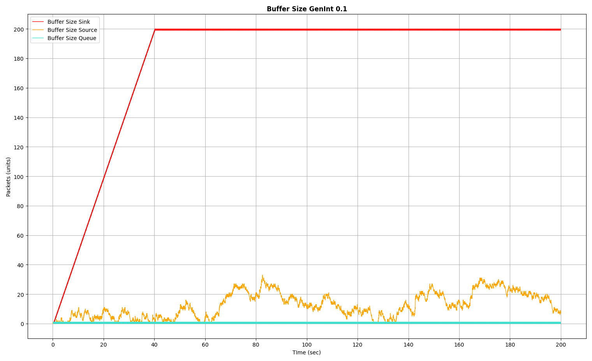|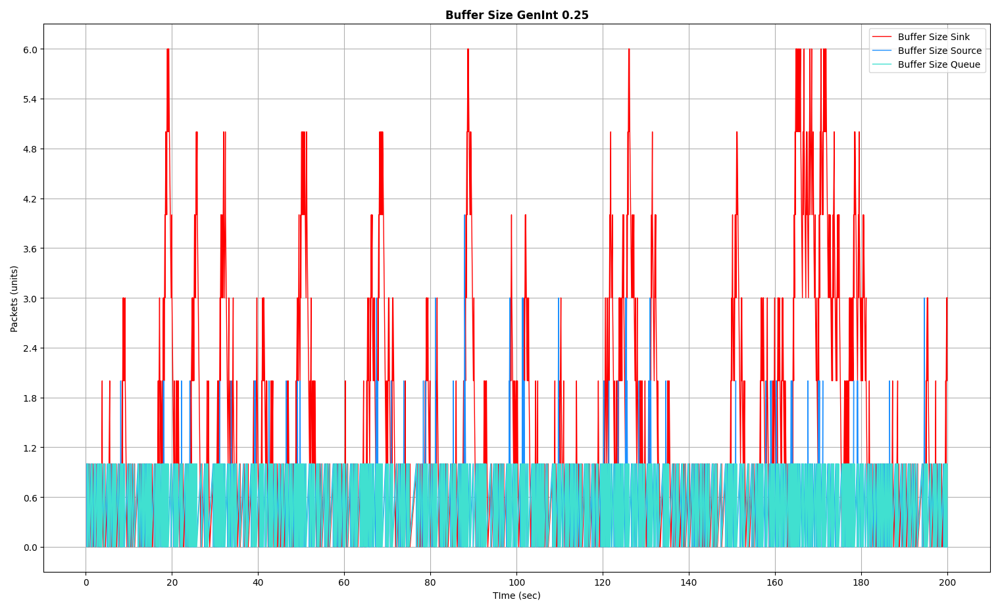| 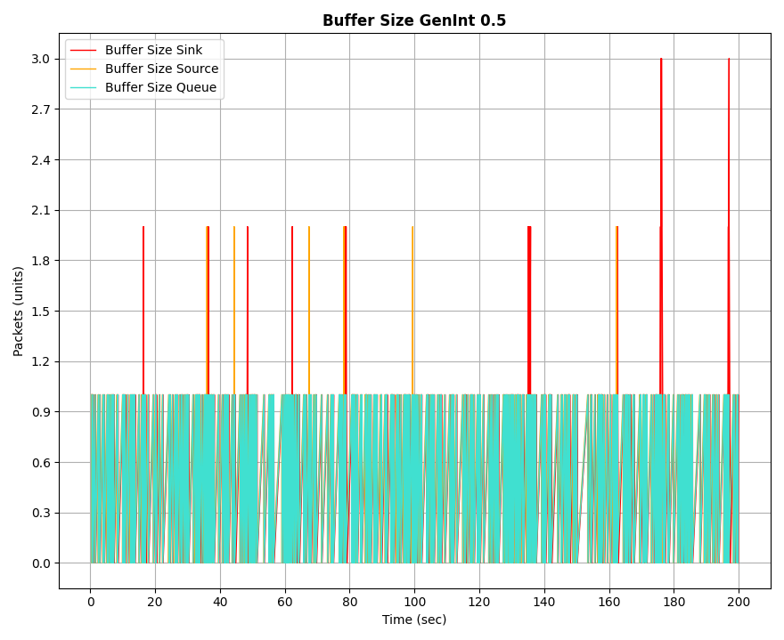|

Como se observa, mientras mayor es el intervalo de generación de paquetes, menor será la cantidad de los mismos y por tanto, menor es la pérdida de paquetes en el búfer del consumidor, ya que tiene más tiempo para procesarlos.

El caso problemático es más visible con el valor 0.1, puesto que en los otros no se ve una notable perdida de paquetes (si es que la hay).

| 0.1 |
|-----|
||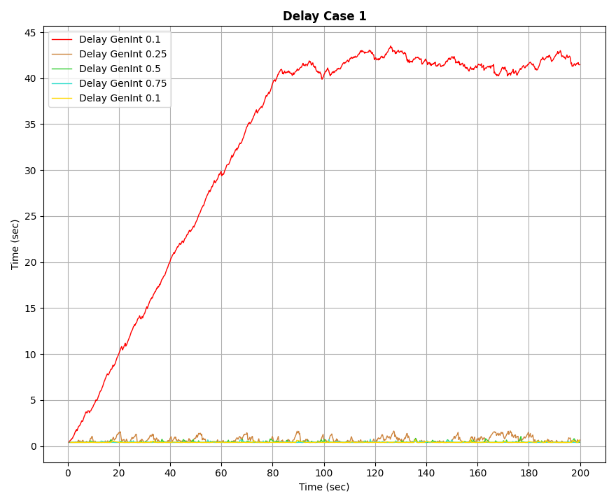|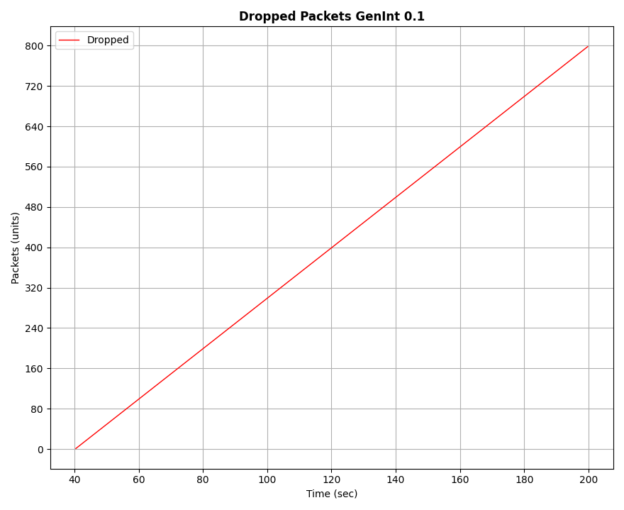|

El problema ocurre con el intervalo establecido en 0.1, ya que como podemos ver en las gráficas, saturó al búfer del receptor (NodeRx), provocando asi la inevitable perdida de paquetes.

Gracias a los gráficos obtenidos se puede ver una clara relación entre la saturación del búfer con el incremento de la tasa de delay. El comúnmente llamado cuello de botella.

Como las métricas de los otros nodos no sufrieron modificaciones, vemos que fluctúan en valores mucho menores al límite de sus capacidades. 

Además, aunque parezca redundante, la situación se mantiene igual hasta el final de la simulación (200 paquetes constantes), es decir, no logra compensarse ni recomponerse.
Observacion: En el intervalo de generacion 0.1 es el unico que se muestra una perdida de paquetes explicita, veremos en otros graficos que el calculo de paquetes que se envian contra los que llegan que se pueden presentar caidas que aparentan una perdida de paquetes pero son simplemente la simulacion parando antes de que lleguen todos los paquetes. 

#### Caso 2 - Problema de Control de Congestión
Para este caso se establecieron las siguientes tasas de transferencia:
- Entre la cola intermedia y la cola Rx: 0.5Mbps
- Entre la cola Tx y la cola intermedia: 1Mbps
- Entre la cola Rx y el recolector: 1Mbps

---
##### Observaciones:
Se realizaron pruebas variando entre los siguientes intervalos de generación de paquetes: 0.1, 0.25 y 0.5.

Se obtuvieron los siguientes resultados:

| 0.1 | 0.25 | 0.5 |
|-----|-----|-----|
|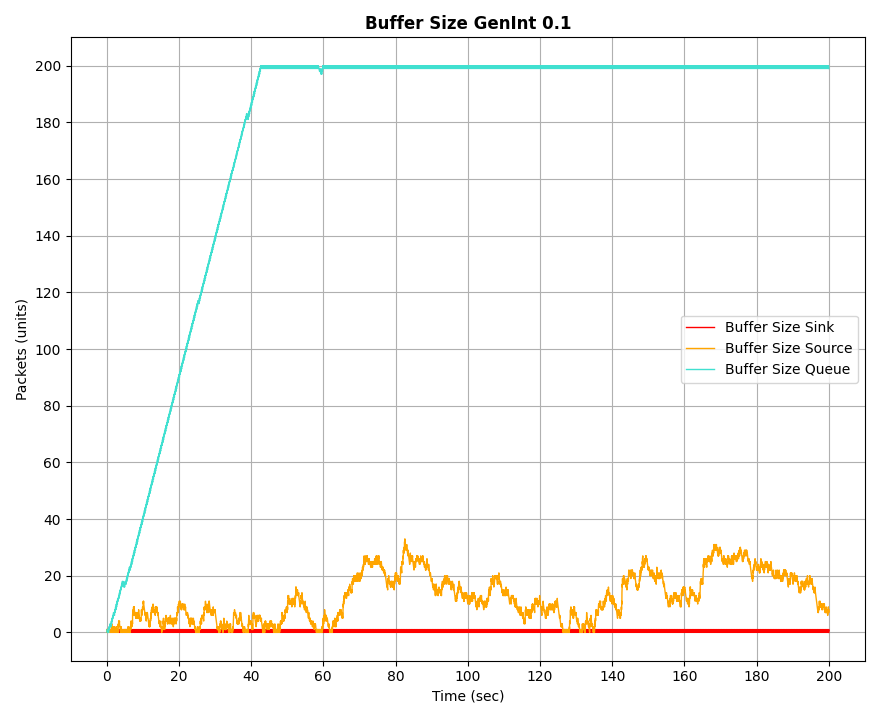||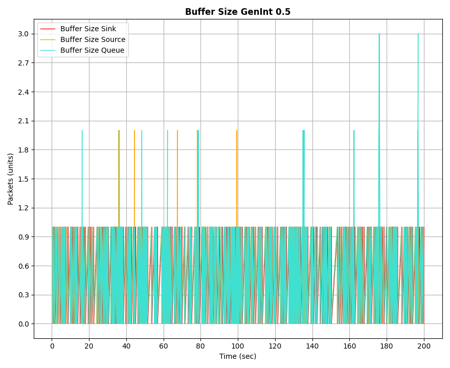|

Nuevamente el problema es más visible en intervalos menores, por lo anterior mencionado.

El caso problemático es más visible con el valor 0.1

| 0.1 |
|-----|
||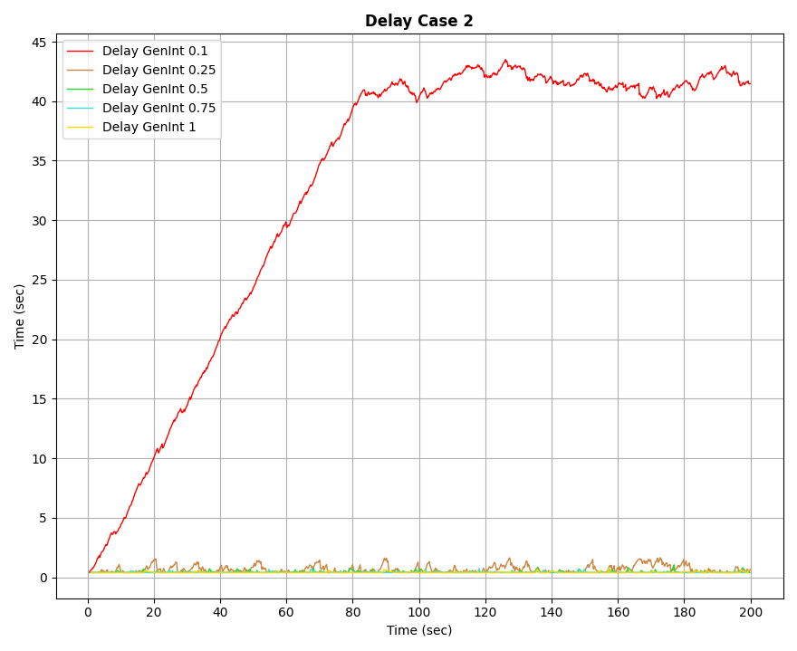|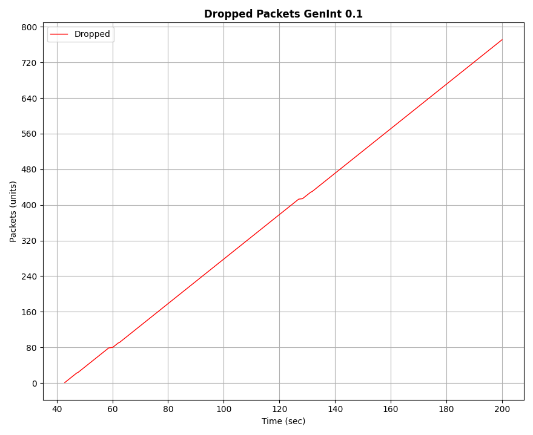|

Como puede verse, los casos son análogos. La única diferencia está en el lugar donde se produce la saturación del búfer, en el caso 1 claudico el buffer del receptor (NodeRx) y en el caso el buffer intermedio (Queue).

## Parte 2 Metodo
Para esta instancia, se diseño un algoritmo en las Queue de NodeTx y NodeRx, ademas de un rediseño del nodo Queue para simular control de flujo y congestion en los casos descritos anteriormente. 

### Preliminares 
Se considero en primera instancia generar un nuevo tipo de paquete (usando la definición de paquetes packet.msg) con la idea de construir un protocolo de parada y espera simple, sin embargo surgieron problemas con las dependencias (acarreados por problemas de instalacion) y se termino considerando un desaprovechamiento de la red implementar este tipo de protocolo.

### Implementacion 
Los protocolos de control de congestion se basan en la propiedad de tamaño variable de las ventanas de recepcion de los bufers en nodos TCP, bajo esta teoria construimos un algoritmo que detecta cuando un bufer esta cerca de saturarse (particularmente al 80%) para informar al emisor que debe reducir la transferencia de paquetes. La idea es darle tiempo al bufer de "desaturarse" para nuevamente aumentar la transferencia, y asi sucesivamente hasta que termine el tiempo de ejecucion.
Los bufers modificados se denominaran como `TransportRx` y `TransportTx` y estaran en el lugar de las Queue de NodeTx y NodeRx. 
La red tambien se modificara para soportar feedback, agregando una queue_0 y una queue_1, ambas del mismo tipo `Queue`. 

| 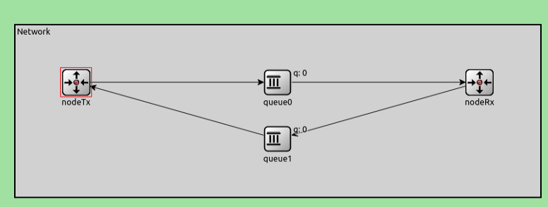|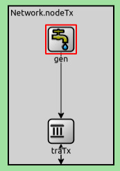|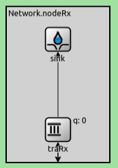|

Esto nos permite tener un mismo enfoque para ambos casos, prevenir la perdida de paquetes y generar un canal de feedback.

Basandonos en el tipo de generacion de paquetes, los resultados del analisis de la primera parte y la composicion de la red, nuestra hipotesis es que, como no podemos controlar directamente la generacion de paquetes, es decir, no podemos incidir en la capa de aplicacion directamente, el bufer saturado sera el del productor. Esto no nos preocupa porque su tamaño si soportaria esta sobrecarga, a diferencia de las otras dos colas. 

### Resultados:
#### Caso 1 - Control de flujo

Se usaron los mismos parametros que en el caso 1 de la parte 1
| 0.1 | 0.25 | 0.5 |
| --- | --- | --- |
| 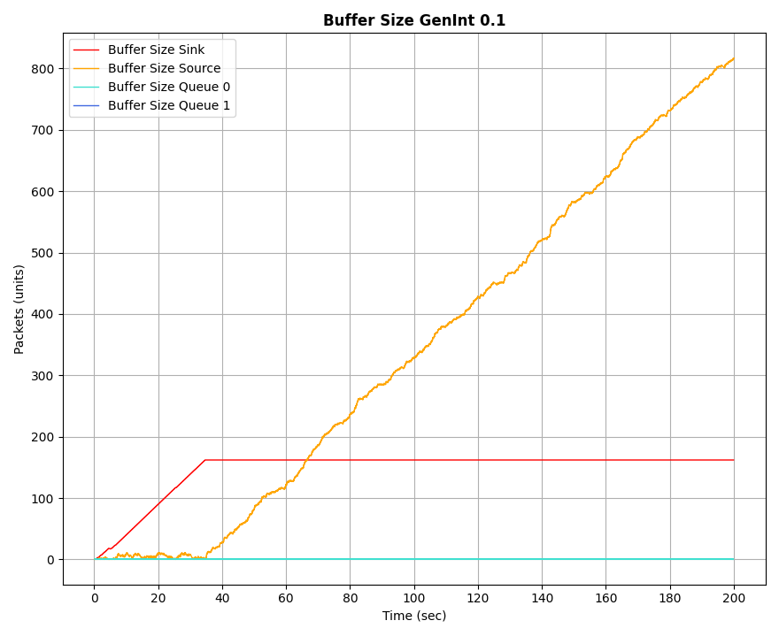       | 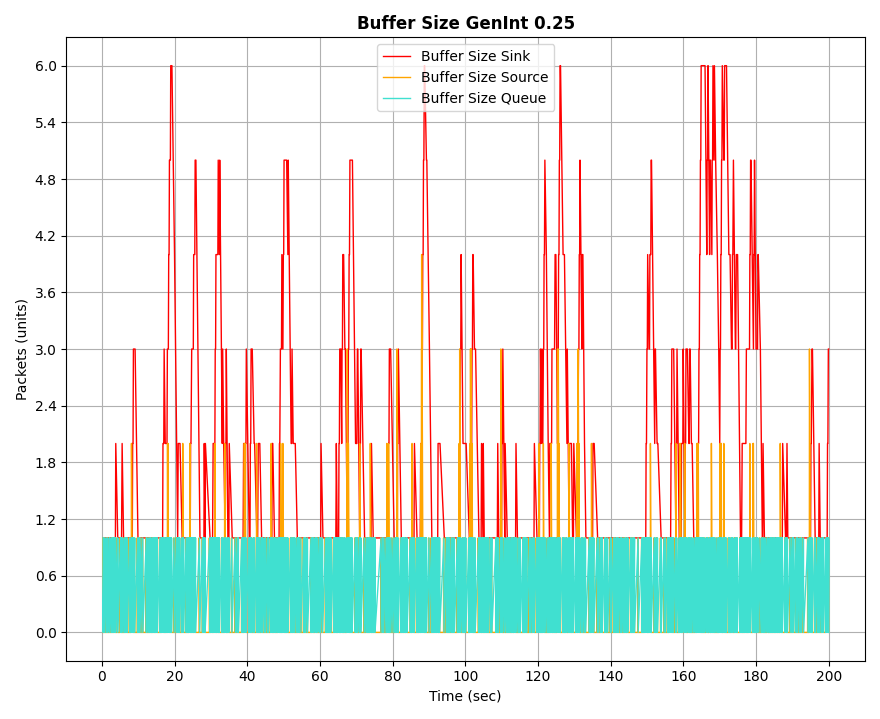       | 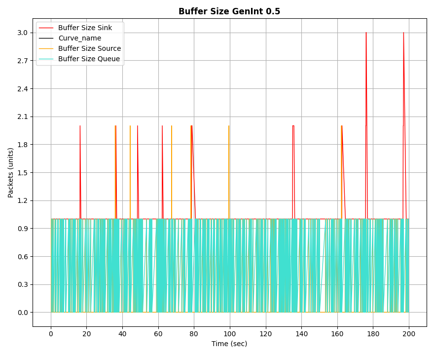       |

El algoritmo previene la perdida de paquetes logrando que el bufer nunca se sature, sin embargo, nuestra hipotesis parece comprobarse al observar los graficos con intervalos de generacion de paquetes en 0.1. Pues en cuanto el bufer se estabiliza en 160 (el 80% del su capacidad total), el bufer del nodo transmmisor es el que crece linealmente. Por esto mismo la grafica de delay tiene un comportamiento similar pero con mayor cantidad, debido a los paquetes en espera que si se contabilizan.

| 0.1 |
|-----|
| |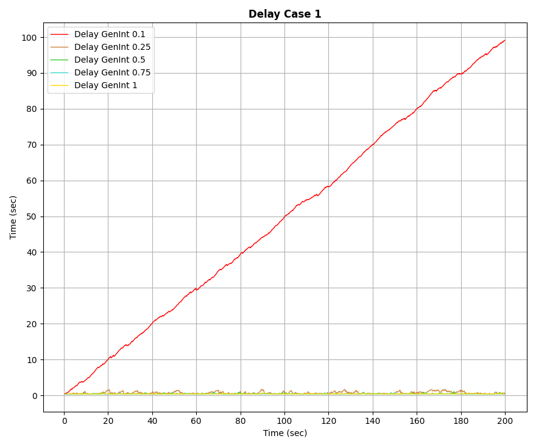|

#### Caso 2 - Control de congestión

Se usaron los mismos parametros que en el caso 2 de la parte 1 

| 0.1 | 0.25 | 0.5 |
| --- | --- | --- |
| 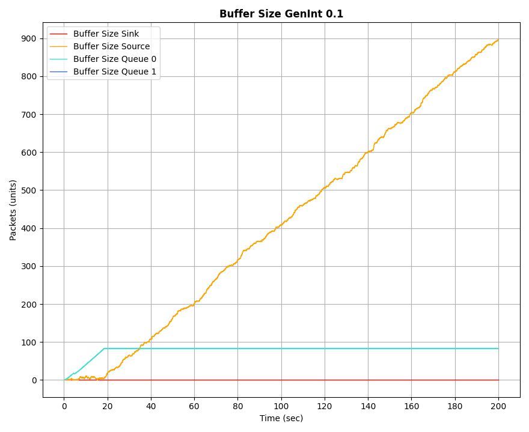       | 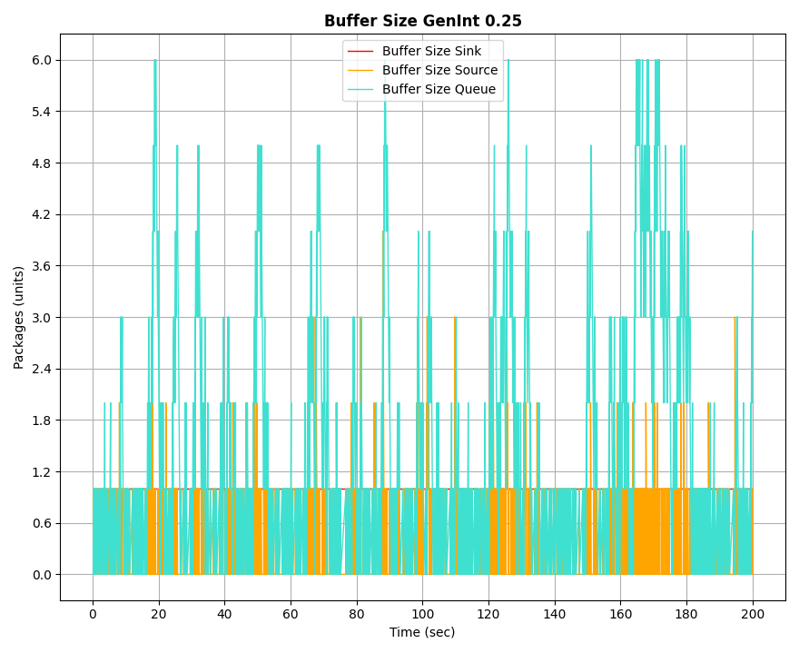       | 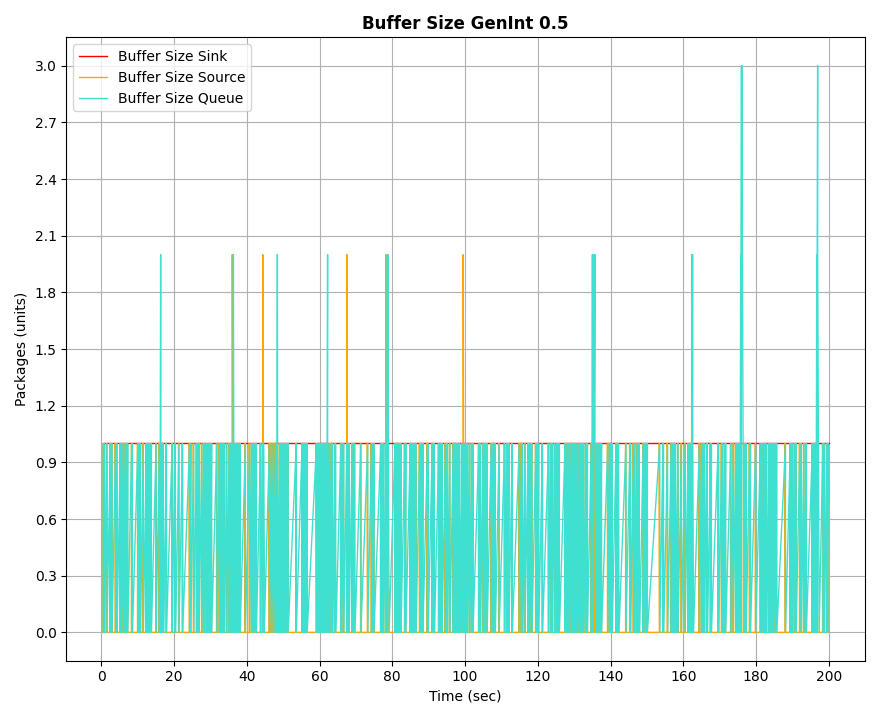       |

Podemos observar un comportamiento muy similar al caso anterior, pareciendo respaldar nuestra hipotesis. 

| 0.1 |
|-----|
| |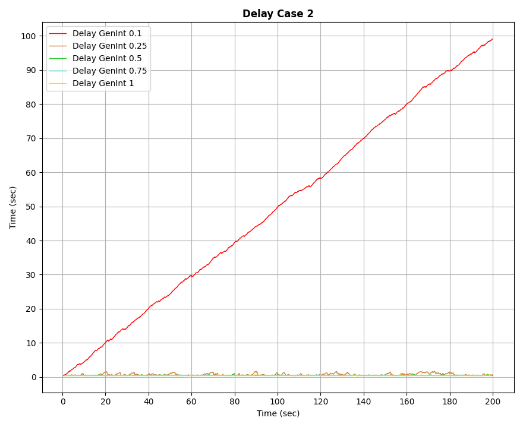|

Nuevamente los casos son analogos, y por tanto su comportamiento es similar. Esto se debe principalmente a la estructura de cada nodo, independientemente de que nodo se trate, el funcionamiento del algoritmo deberia ser igual. 
Cabe resaltar que esto no funcionaria en una red real. En este segundo caso donde el problema es de congestion, es decir en red, la forma de detectar la saturacion de los nodos intermedios muchas veces logran verse cuando se agotan los paquetes.
Aclaracion: En estos casos no se detectaron perdidas de paquetes explicitas, a diferencia de la parte 1 del proyecto, la diferencia entre paquetes que se envian y los que llegan se trata de la simulacion terminando antes de que lleguen todos los paquetes que se enviaron.

#### Graficos conjuntos:
|Grafico de carga util|Grafico de Delay|
|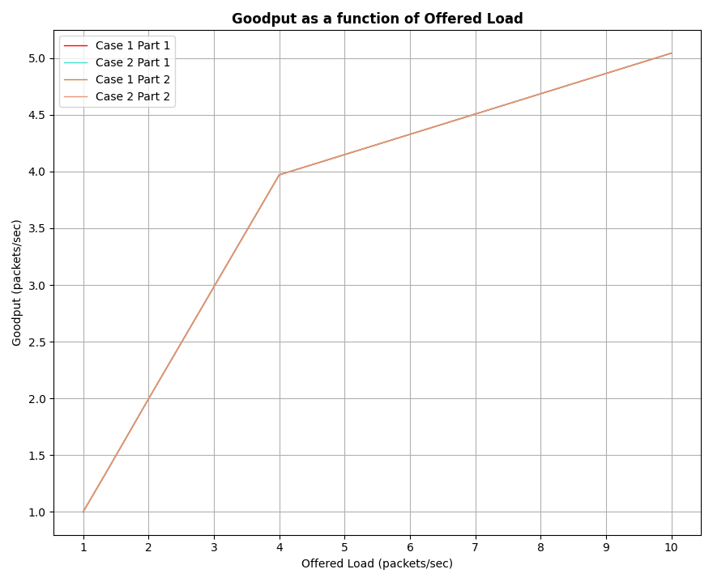|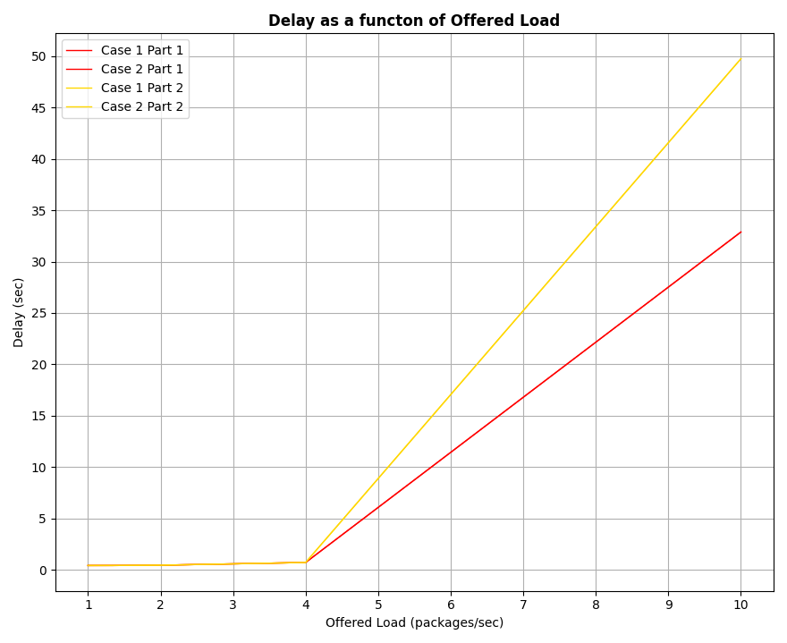|

Aqui podemos observar dos graficos:
* Primero la carga util con respecto a los intervalos de generacion, Son iguales!!
	Esto se debe, como se aclaro antes, a la diferencia entre paquetes que se envian y los que llegan cuando termina la simulacion.
* Segundo el delay promedio con respecto a los intervalos de generacion.
	Aqui si podemos ver una diferencia puesto que en los casos de la parte 2 el delay aumenta, eso se debe al overhead agregado de verificaciones de los bufferes para evitar la perdida de paquetes, si bien empiezan con el mismo delay, conforme se llenan los bufferes aumenta el delay.

## Discusiones: 
Podemos observar muchos puntos a mejorar en la implementacion del algoritmo, asi como la observacion de que cada protocolo debe ser implementado bajo una necesidad en particular para saber como manejar los recursos o priorizar criterios.
Aunque esta vez decidimos priorizar la optimizacion de la red al evitar perder paquetes y por tanto evitando retransmisiones, a grandes rasgos podria interpretarse como simplemente desplazar el cuello de botella de un punto a otro. 
Aunque el protocolo cumple el objetivo general del proyecto, sabemos que podrian agregarse mejoras a cambio de ampliar el entorno de aplicacion y teniendo un conocimiento mas firme en las tecnologias y entornos utilizados.
Mejoras que se pudieron hacer:
* Ventana de congestion
* Utilizacion de una modificacion del tipo paquete (packet.msg). 
	Esto se puede hacer creando un nuevo archivo llamado FeedbackPkt.msg en el cual se definira un tipo paquete con nuevas variables para ayudar a la hora de enviar mensajes de tipo feedback con informacion importante e incorporandolo en el makefile en la seccion MSGFILES, esto al compilar creara automaticamente todas las funciones y archivos necesarios.
* Incorporacion mas eficiente de los feedback entre las colas.

## Referencias: 
Consultas a IA (Se utilizo Gemini): 

* Consulta 1: Se sugiere crear una gráfica de carga transmitida (eje x) vs. carga recibida (eje y), ambas
expresadas en paquetes por segundo (ver Figura 6-19 del libro Tanenbaum). En caso de que
haya pérdidas de paquetes también se sugiere medir y comparar estadísticas de ese
fenómeno.
how to do the calculation?
Respuesta 1: The calculation for the graph and packet loss involves three main parts:

    1. Extracting Load Data:

        Use your traffic capture tool's export or analysis features to extract the following data:
            Total Transmitted Packets: The total number of packets sent by the traffic generation tool on the first device.
            Total Received Packets: The total number of packets captured by the traffic capture tool on the second device.

    2. Calculating Packet Loss:

        Once you have the total transmitted and received packets, you can calculate the packet loss percentage using the following formula:

    Packet Loss (%) = (Total Transmitted Packets - Total Received Packets) / Total Transmitted Packets * 100

    Aclaracion 1: Si bien este calculo no fue suficiente, lo adapte para que sirviera para nuestros usos.

* Consulta 2: Luego tambien se utilizo para recordar operaciones de excel (como dividir, como moverme rapidamente por el entorno, etc.)

Otras herramientas y bibliografia: 

* https://github.com/fa201/plotview
* Tanembaum. Computer Networks: quinta edición del 2011
* Kurose, J. F. and Ross, K. W. Computer Networking - A Top Down Approach. 7th Edition, Pearson, 2017
* https://omnetpp.org/documentation/
